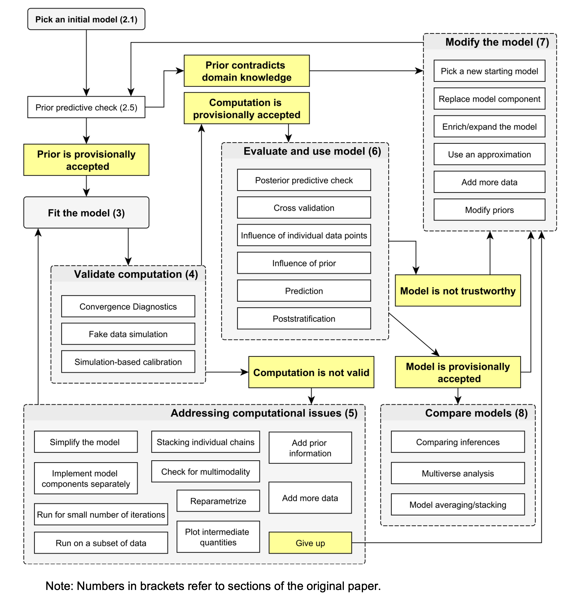
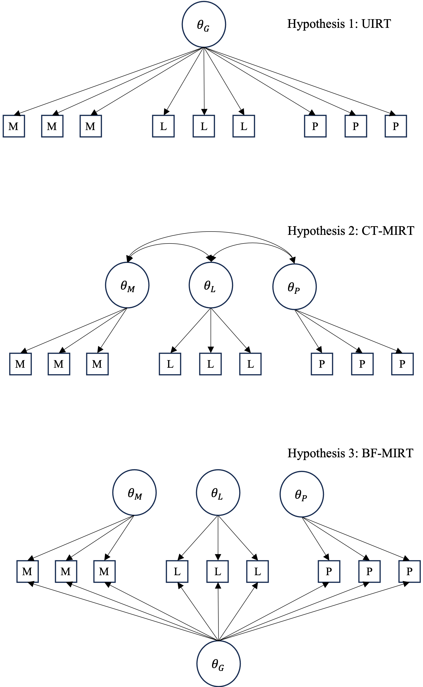
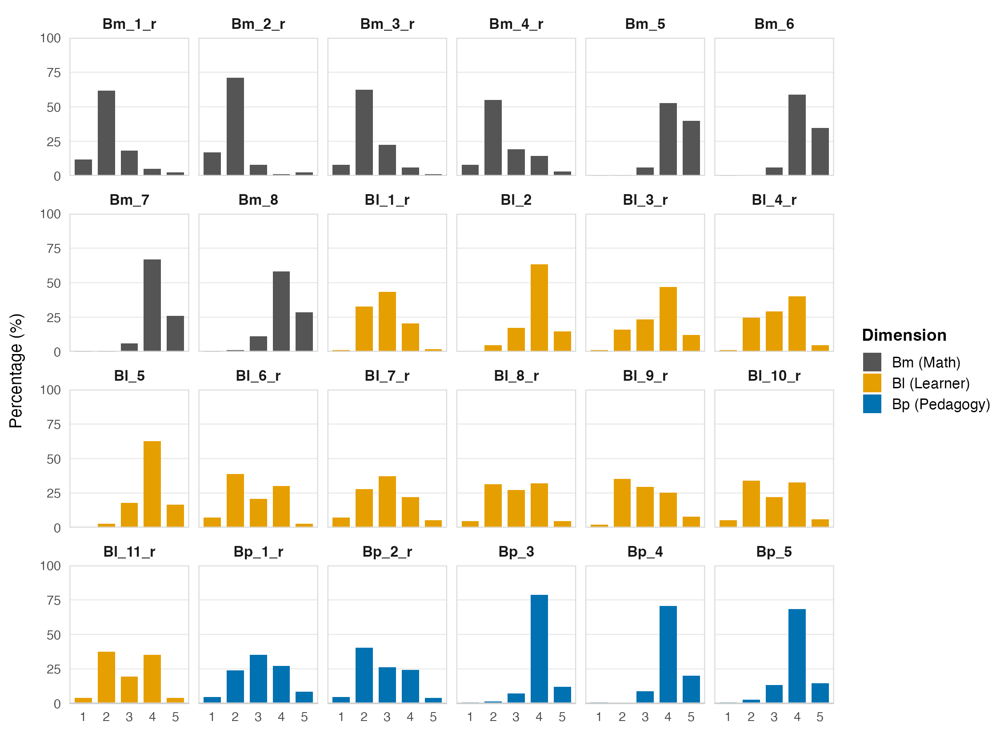

# Introduction

Consider a common scenario in educational measurement: a researcher has adapted a multidimensional questionnaire for a new population, collected responses from a few hundred participants, and now needs to validate the instrument. The validation process requires more than fitting a single model. It involves a series of interrelated decisions about the response scale, the dimensionality of the construct, the behaviour of individual items, and the appropriateness of the chosen model specification for different subgroups. Each decision depends on diagnostic evidence from the previous step, making the process inherently iterative. Bayesian item response theory (IRT) is well suited to this task. The full posterior distributions it produces provide parameter-level diagnostic information that each decision point requires, and its prior-based regularisation stabilises estimation when sample sizes are limited. This diagnostic infrastructure is valuable regardless of sample size, but becomes especially consequential when data are sparse and each modelling decision must be justified on the basis of uncertain estimates.

@gelman2020bayesi have articulated a general workflow framework for iterative Bayesian modelling that is domain-general by design, with worked examples spanning a range of applied settings. Several tutorials have since demonstrated how Bayesian IRT models can be specified and estimated in accessible software [e.g., @burkner2021bayesi; @winter2025tutoria; @burkner2019ordina], but these focus primarily on model specification and estimation rather than on the iterative diagnostic logic that connects one modelling decision to the next. What has received less attention is the instantiation of this iterative logic within the specific domain of ordinal IRT instrument validation. The decisions involved here are not only statistical but substantive: whether to collapse response categories requires weighing empirical sparsity against semantic distinctness; whether to free discrimination parameters is simultaneously a model-fit question and a diagnostic tool for identifying problematic items; whether to choose a slightly worse-fitting model with cleaner diagnostics over a better-fitting model with unstable leave-one-out approximations requires reasoning that extends beyond any single metric. Existing tutorials tend to treat these as isolated technical choices rather than as a connected sequence in which each step constrains and motivates the next.

This tutorial instantiates the Bayesian workflow for ordinal IRT instrument validation, using the validation of a 24-item teacher belief instrument ($n$ = 155) as a running case study. It is intended as a methodological contribution to three areas. First, it provides a structured, reusable decision framework for IRT instrument validation, in which the logic connecting each step is made explicit so that researchers facing similar decisions with their own data can adapt the reasoning rather than simply replicate the procedures. Second, it demonstrates how the diagnostic infrastructure of Bayesian estimation, including posterior distributions, leave-one-out cross-validation, Pareto $\hat{k}$ diagnostics, and posterior predictive checks, can be integrated into substantive decision-making at each stage of the workflow, rather than applied as post-hoc model checks. Third, it implements the entire workflow within the `brms` package [@burkner2017brmsb], showing that complex multidimensional IRT models, including correlated-traits and bi-factor specifications with item-specific discrimination, covariates, and differential item functioning, can be specified, compared, and evaluated within a single, accessible software environment. The workflow guides researchers through five integrated steps: (1) preprocessing decisions for sparse ordinal categories, (2) comparing competing dimensional structures, (3) using freed discrimination parameters as diagnostic tools, (4) selecting among ordinal link functions via cross-validation and stability diagnostics, and (5) incorporating covariates and differential item functioning analysis.

# Bayesian (M)IRT: A Brief Overview

Item response theory [IRT, @embretson2013itema; @vanderlinden1997itema] has been widely applied across the human and social sciences to model latent constructs such as abilities, attitudes, or beliefs through the probabilistic relationships between item responses and underlying traits. Compared with classical test theory, IRT provides item-level analysis with considerably greater flexibility and modelling freedom, making it a central tool for developing and refining measurement instruments in educational and psychological research. Bayesian estimation extends these advantages in two respects: prior-based regularisation stabilises the highly parameterised models that frequentist methods struggle with at small sample sizes, and the full posterior distributions make parameter-level uncertainty directly visible, supporting the diagnostic reasoning that instrument validation requires at any sample size.

However, standard frequentist IRT faces increasingly apparent challenges, particularly when multidimensional structures are involved. Although a variety of multidimensional IRT (MIRT) models have been developed, their high parameterisation means that frequentist estimation, primarily via marginal maximum likelihood [MML, @chalmers2012mirt], is often only viable with large(r) samples. Most IRT textbooks recommend a minimum of $N = 250$--$500$ for stable estimation [@svetinavaldivia2024numbera; @jiang2016samplea; @forero2009estima], and for multidimensional polytomous models the requirement rises further, with $N > 500$ commonly expected. Yet in educational and psychological research, small samples are the norm rather than the exception [@mcneish2016usinga; @mcneish2017challea], and abandoning the multidimensional properties of an instrument simply because the sample is too small for frequentist estimation is difficult to justify on substantive grounds.

Bayesian estimation offers an alternative by combining observed data with prior knowledge through Bayes' theorem. For parameters $\boldsymbol{\theta}$ and observed data $\mathbf{y}$, the posterior distribution is:

$$
p(\boldsymbol{\theta} | \mathbf{y}) = \frac{p(\mathbf{y} | \boldsymbol{\theta}) \, p(\boldsymbol{\theta})}{p(\mathbf{y})}
$$ {#eq-bayes}

where $p(\mathbf{y} | \boldsymbol{\theta})$ is the likelihood of the data given the parameters, $p(\boldsymbol{\theta})$ encodes prior beliefs about the parameters, and $p(\mathbf{y})$ is the marginal likelihood serving as a normalisation constant. The posterior $p(\boldsymbol{\theta} | \mathbf{y})$ thus integrates information from both the data and the prior into an updated distribution over the parameters. In the context of IRT, letting $\mathbf{y}$ represent the observed item responses and $\boldsymbol{\theta} = (\theta_p, \xi_i, \alpha_i)$ represent the person abilities, item difficulties, and discrimination parameters, @eq-bayes becomes:

$$
p(\theta_p, \xi_i, \alpha_i | \mathbf{y}) \propto p(\mathbf{y} | \theta_p, \xi_i, \alpha_i) \, p(\theta_p, \xi_i, \alpha_i)
$$ {#eq-bayes-irt}

Here $p(\mathbf{y} | \theta_p, \xi_i, \alpha_i)$ is the IRT likelihood, that is, the product of item response probabilities across all persons and items as determined by the specific model and its link function (see @apx-models for detailed specifications). The prior $p(\theta_p, \xi_i, \alpha_i)$ encodes beliefs about plausible parameter ranges. In practice, weakly informative priors are standard: for example, $\mathcal{N}(0, 3)$ for person and item parameters constrains estimates to a reasonable range on the logit scale without imposing substantive assumptions, while providing sufficient regularisation to stabilise estimation [@burkner2021bayesi; @mcelreath2018statisa]. The posterior distribution is then characterised via Markov chain Monte Carlo (MCMC) sampling, yielding draws from the joint distribution of all parameters rather than point estimates.

This regularisation is particularly effective for the highly parameterised models that frequentist methods struggle with most. Frequentist MIRT depends on integrating over the latent trait distribution within the marginal likelihood $p(\mathbf{y})$, a procedure that demands large samples for numerical stability. When data are insufficient, frequentist software may fail to converge or produce boundary estimates. Even with adequate samples, multidimensional models require integration over the latent trait distribution that scales exponentially with dimensionality, forcing frequentist implementations such as `mirt` [@chalmers2012mirt] to rely on the MH-RM algorithm[^MHRM], which uses Metropolis-Hastings sampling to approximate the intractable integrals. Frequentist MIRT thus borrows Bayesian computational machinery while remaining within a frequentist estimation framework. By contrast, Bayesian IRT employs MCMC natively and, through the prior $p(\theta_p, \xi_i, \alpha_i)$, stabilises precisely those parameters that are most data-starved. The advantages are now well documented: @fujimoto2020genera established a general Bayesian MIRT framework encompassing bi-factor and other complex structures, demonstrating robust performance on an empirical dataset of only $N = 121$; @konig2022robust showed that a hierarchical Bayesian two-parameter logistic model with appropriately specified weakly informative priors can produce unbiased item and person parameter estimates even with $N < 100$. More broadly, Bayesian estimation outperforms MML for multidimensional IRT at moderate sample sizes and is particularly beneficial when response categories are sparsely endorsed [@bainter2019impact; @padgett2024regula], a common occurrence in Likert-scale instruments where extreme categories receive few responses.

[^MHRM]: Metropolis-Hastings Robbins-Monro [@cai2010highdi].


Beyond outperforming frequentist methods in small samples, Bayesian IRT addresses a more fundamental limitation of the frequentist approach: the reliance on point estimates, which carries an inherent risk of convergence to local optima and obscures the full uncertainty in the estimates. Even large-scale assessment programmes such as PISA, where frequentist IRT is standard, acknowledge this limitation by employing plausible values, that is, multiple imputations drawn from an approximate posterior distribution, to represent uncertainty in individual ability estimates for secondary analyses [@oecd2024pisa]. In Bayesian IRT, full posterior distributions are a natural product of the estimation framework rather than a post-hoc correction, providing a complete and coherent representation of parameter uncertainty.

## Implementation via `brms`

@deboeck2004explan demonstrated that IRT models can be estimated within a generalised linear mixed model (GLMM) framework. The R package `brms` [@burkner2017brmsb], which has become a widely used platform for Bayesian multilevel modelling, builds on this equivalence. It calls `Stan` [@carpenter2017stana] as its backend for Hamiltonian Monte Carlo sampling, enabling efficient exploration of the high-dimensional parameter spaces characteristic of multidimensional IRT.

The GLMM-based approach as implemented in brms does have known limitations. Most notably, `brms` does not support jointly specifying latent variables within the model formula, which means that certain complex modelling strategies, such as the explanatory multidimensional IRT framework of @kleinsasser2024person where person-level regression models are estimated simultaneously within the IRT likelihood, are not currently specifiable. Nevertheless, for the class of models covered in this tutorial, `brms` offers a compelling combination of one-stop integration and concise, transferable syntax. Within a single formula interface, researchers can specify multiple ordinal model families (cumulative and adjacent-category links), multidimensional structures (correlated-traits and bi-factor), item-specific discrimination via distributional regression, covariates, and differential item functioning, all with built-in model comparison through approximate leave-one-out cross-validation [@vehtari2017practia].

Bayesian MIRT can also be implemented by writing custom likelihoods directly in `Stan` [@carpenter2017stana; @luo2018usinga] or in JAGS/BUGS [@plummer2003jags; @lunn2000winbug; @curtis2010bugs]. These alternatives offer greater modelling flexibility, but their syntax typically presents a substantial technical barrier for applied researchers in education and psychology. Among frequentist IRT packages, `mirt` [@chalmers2012mirt], `TAM` [@robitzsch2013tam], and `flexMIRT` [@chung2020flexmi] each support specific model classes, but most do not provide the full Bayesian estimation and diagnostic infrastructure needed for the iterative workflow demonstrated here. For a detailed comparison of `brms` with these alternatives, see @burkner2021bayesi.

# Ordinal IRT Model Families and Related Work

We will briefly introduce the ordinal IRT models and dimensional structures used in this tutorial, alongside the related work that informs our approach.

The most constrained yet concise ordinal IRT model used in this paper is the rating scale model [RSM, @andrich1978rating], which uses an adjacent-category logit link and assumes that all items share both the same set of thresholds and the same discrimination ($\alpha = 1$). Relaxing the threshold constraint so that each item has its own threshold spacing yields the partial credit model [PCM, @masters1982rasch]. Both the RSM and PCM are one-parameter models in the Rasch family, where discrimination is constrained to be equal across items. Introducing item-specific discrimination produces their two-parameter generalised counterparts: the GRSM and GPCM, respectively. Another widely used two-parameter model is the graded response model [GRM, @samejima1969estima], the polytomous extension of the two-parameter logistic model (2PL) for ordered categories, which differs from the adjacent-category family in its use of a cumulative logit link: rather than modelling the odds of each category relative to its neighbour, the GRM models the cumulative probability $P(Y \geq c)$ of responding at or above each threshold.[^3] @burkner2019ordina provide a detailed treatment of the distinction between adjacent-category and cumulative link functions, demonstrating that the two families can produce substantively different parameter estimates and model fit for the same data. @burkner2021bayesi further shows how all of these models can be specified in `brms` using its distributional regression syntax, where discrimination is introduced via `disc ~ 1 + (1 | item)` and the link function is controlled through the family argument. Importantly, freeing discrimination is not merely a matter of model flexibility: as we demonstrate in the workflow, it also serves a diagnostic purpose, revealing which items contribute meaningful information and whether threshold anomalies arise from model constraints rather than data problems.

[^3]: In its original formulation [@samejima1969estima], the GRM estimates item-specific thresholds. The implementation used in this tutorial is a constrained variant in which threshold spacing is shared across items, with item differences captured through a location parameter that shifts all thresholds equally. See @apx-models for details.

The choice of ordinal model family is crossed with the choice of dimensional structure. Instruments designed with subscale structure motivate multidimensional specifications: a correlated-traits model allows subscale-specific latent traits to covary freely, while a bi-factor model decomposes variance into a general factor shared across all items and orthogonal subscale-specific residuals. @boeck2012irtreea showed that both structures can be expressed as GLMMs through what they term IRTree models, in which mapping matrices specify how internal-node latent variables combine to produce end-node latent variables. In their implementation in `lme4`, the bi-factor structure corresponds to a nested latent-variable tree: a general internal node contributes to all end-node latent variables while subscale-specific internal nodes each contribute to only one, with orthogonality enforced through the mapping matrix specification. In `brms`, an approximate specification can be achieved more concisely by manipulating the correlation structure of random effects: the single-bar notation `|` estimates an unrestricted covariance matrix across latent traits (for the correlated-traits model), while the double-bar notation `||` suppresses correlations between random-effect terms, imposing the orthogonality constraint required by the bi-factor structure.

Our aim differs from the technical references discussed above, which focus on model specification and estimation for specific ordinal IRT or dimensional structures. Instead, we are concerned with the iterative process of selecting among these models based on accumulating diagnostic evidence. @gelman2020bayesi (@fig-gelman-workflow) have proposed a general Bayesian workflow framework that emphasises iterative cycles of model building, inference, and checking. Their framework is comprehensive and domain-general, and the Bayesian approach offers considerable flexibility for researchers to adapt the workflow steps to their specific research purposes. The key emphasis is on constructing optimal models through a transparent process that itself provides information about why those models are preferred. In this tutorial, we aim to instantiate this framework within the specific context of ordinal IRT instrument validation.

The most closely related work is @winter2025tutoria, who present a Bayesian IRT workflow for validating a teacher stress inventory ($n = 329$), incorporating prior predictive checks, posterior predictive checks, and prior sensitivity analysis. Their tutorial provides valuable tools for evaluating and refining a model whose general structure is relatively well established. Our work addresses a complementary situation: when the researcher's starting point is more exploratory, encompassing competing dimensional structures, multiple link function families, and items whose quality is not yet known. This more exploratory orientation aligns with how measurement validation typically unfolds in education and psychology, where instruments are often adapted across cultural and institutional contexts and the appropriate model specification cannot be assumed in advance.

{#fig-gelman-workflow width="70%"}

# Diagnostic Toolkit

This section briefly introduces the diagnostic tools used throughout the workflow. Each tool is discussed in greater detail at the point where it is applied; the purpose here is to establish their logic and, where relevant, their limitations.

## Convergence diagnostics

Satisfactory convergence of the MCMC sampler is a prerequisite for interpreting any Bayesian model output. We assess convergence using the split-chain $\hat{R}$ statistic [@vehtari2021ranknoa], with values below 1.01 required for all parameters, alongside the effective sample size (ESS), for which a minimum of 400 total draws is recommended [@vehtari2021ranknoa]. The presence of divergent transitions, which signal regions of the posterior geometry that the sampler fails to explore, is also monitored.

Although all models reported in this tutorial met these convergence criteria after tuning, reaching convergence for complex multidimensional models required iterative adjustment. In practice, we found it useful to begin with short runs (e.g., 500 iterations) to verify that a model specification is viable before committing to full sampling. When convergence issues arose, typically with the more highly parameterised models, they were resolved by increasing `adapt_delta` (reducing the step size of the Hamiltonian Monte Carlo integrator, at the cost of slower sampling) and `max_treedepth` (allowing deeper trajectory exploration per transition). Persistent convergence failure after such adjustments generally indicates a specification problem rather than a tuning problem. For the more computationally demanding models, we used `cmdstanr` [@gabry2025cmdsta] as the backend in place of the default `rstan`, which provided substantial speed improvements; all code, including backend configuration, is available in the companion repository.

## Model comparison: LOO-CV

We compare competing models using Pareto-smoothed importance sampling leave-one-out cross-validation [PSIS-LOO, @vehtari2017practia], which approximates the expected log pointwise predictive density (ELPD), a measure of out-of-sample predictive accuracy where higher (less negative) values indicate better performance. Models are compared via the difference in ELPD ($\Delta$ELPD) and its standard error; a difference exceeding approximately two standard errors is conventionally treated as meaningful [@sivula2025uncert].

The reliability of the PSIS-LOO approximation is monitored through Pareto $\hat{k}$ diagnostic values, which indicate how well the importance sampling approximation works for each individual observation. Values below 0.7 are generally acceptable; values above 0.7 indicate that the leave-one-out posterior for that observation diverges substantially from the full posterior, potentially compromising the ELPD estimate [@vehtari2015pareto]. When only a small number of observations have problematic $\hat{k}$ values, the overall ELPD estimate is unlikely to change substantially and the comparison can still serve as a useful reference. However, problematic $\hat{k}$ values must be resolved to obtain a complete set of diagnostics. In particular, the Monte Carlo standard error (MCSE) of the ELPD, which quantifies how much the estimate would vary if the MCMC chains were run again, is only estimable when all $\hat{k}$ values fall within the acceptable range, because the theoretical variance of the importance weights diverges for observations with $\hat{k} > 0.7$. When problematic values are detected, remedies include moment matching (adjusting the MCMC draws to better approximate the leave-one-out posterior) and, if that fails, exact leave-one-out refitting for the affected observations. Both remedies are demonstrated in the workflow.

We recommend that Pareto $\hat{k}$ diagnostics be reported alongside ELPD differences as a matter of practice: a model with the best ELPD but many problematic $\hat{k}$ values may be a less trustworthy choice than a slightly worse-fitting model with clean diagnostics.

An important scope condition applies throughout: LOO-CV is only valid for comparing models fitted to the same set of observations with the same response variable. This constraint is relevant at several points in the workflow. When response categories are collapsed, the response variable changes and ELPD values from before and after collapsing are not comparable. Similarly, when items are removed, the observation set changes and ELPD values across different item sets cannot be directly compared. At these decision points, the workflow relies on parameter-level diagnostics.

## Item and person parameter visualisations

Throughout this tutorial, we use composite diagnostic plots that display item difficulty and discrimination estimates alongside person ability estimates, all with 95% credible intervals. We refer to these as "Wright maps" by loose convention, following the logic of the traditional Wright map [@wright1979best; @wilson2023constr] to jointly display item and person parameters on scale. Based on @burkner2021bayesi, our versions differ from the traditional format in layout (side-by-side panels rather than a single vertical axis) and in the inclusion of discrimination estimates as a separate panel. The credible intervals are a distinctly Bayesian addition that makes parameter-level uncertainty directly visible.

In terms of diagnostic interpretation, item difficulty does not lend itself to a strict cutoff criterion. What matters is that items are distributed across a reasonably continuous range of the latent continuum and that this range provides adequate coverage of the person ability distribution. Problematic items typically manifest as outlying difficulty values accompanied by excessively wide credible intervals, indicating that the data provide limited information for estimating those items' locations; examples of this pattern will be encountered in the workflow. For discrimination, we adopt the conventional threshold of $\alpha < 0.5$ following @embretson2013itema, below which an item is considered a poor discriminator. In substantive terms, this means that responses to such an item are largely independent of the latent trait and the item contributes minimal measurement information.

It is worth noting that classical item-fit statistics (e.g., infit, outfit, $S$-$X^2$) do not have a direct Bayesian counterpart. @bohn2025previc propose an approach in which fit statistics are computed separately for each posterior draw and then aggregated, but our replication of their method found that this requires substantial computational resources and produces results nearly identical to those obtained from standard frequentist item-fit routines (e.g., using `TAM` package).[^4] A more natively Bayesian approach to item-level diagnostics is prior/posterior predictive checking (ppc), as demonstrated by @winter2025tutoria using prior/posterior predictive $p$-values (ppp). We do not incorporate posterior predictive item checks in this tutorial, though they represent a valuable extension.

[^4]: A replication and optimisation of the @bohn2025previc item-fit approach is available at <https://github.com/lukezed/previc-optimization-demo>.

## Differential item functioning

Differential item functioning (DIF) occurs when respondents from different groups who share the same level of the latent trait have systematically different probabilities of responding to a given item. Within the Bayesian framework, DIF is tested by incorporating group variables as covariates with item-level random slopes, allowing the magnitude of group differences to vary across items while partial pooling regularises the estimates toward a common mean [@burkner2021bayesi]. An item exhibits credible DIF when the 95% credible interval for its group-specific slope excludes zero. Two alternative parameterisations are demonstrated in the workflow, each offering different diagnostic perspectives.

## The role of qualitative judgment

A recurring theme in the workflow is that most modelling decisions are not made on the basis of a single formal criterion. LOO-CV provides valuable evidence about relative predictive performance, but it does not address all relevant considerations: whether threshold ordering is substantively interpretable, whether item discrimination values are diagnostically informative, or whether a statistically preferred model has acceptable Pareto $\hat{k}$ diagnostics. Bayesian estimation supports this kind of integrative judgment by making parameter-level uncertainty visible. Rather than reducing each decision to a binary test, the posterior distributions allow the researcher to weigh multiple sources of evidence, including quantitative model comparisons, parameter diagnostics, and substantive reasoning, at each step. This does not mean that decisions are arbitrary; it means that they are transparent, with the reasoning documented alongside the evidence.

# Case study: Data and setup

## Dataset

The case study uses questionnaire data from secondary mathematics teachers (*n* = 155) in public schools across three urban districts in a city in Zhejiang province, China. The three districts are coded 1, 2, and 3 in descending order of socioeconomic status. Three demographic variables were retained for subsequent differential item functioning analysis: teacher gender (male/female), school district (1/2/3), and the year group taught (7/8/9).

## Instrument

The instrument comprises 24 items measuring the degree to which teachers hold inclusive, equity-oriented beliefs about mathematics education, as opposed to more traditional or exclusionary orientations. It was adapted from the Teacher Education and Development Study in Mathematics [TEDS-M, @tatto2013teachea] with cultural modifications for the Chinese context (e.g., replacing references to "hands-on experiences" with locally recognisable pedagogical reforms such as project-based learning). Items are organised into three subscales:

-   *Beliefs about mathematics* (Bm, 8 items) assess whether teachers view mathematics as a fixed body of rules or as a creative, applied discipline. Items endorsing a formalist view are reverse-coded (e.g., "Mathematics is a collection of rules and procedures" \[Bm_1_r, reverse-coded\]).
-   *Beliefs about learners* (Bl, 11 items) assess whether teachers believe mathematical ability is innate and fixed or accessible to all students (e.g., "To be good at mathematics one needs to be talented" \[Bl_7_r, reverse-coded\]).
-   *Beliefs about pedagogy* (Bp, 5 items) assess teachers' receptiveness to innovative and student-centred teaching approaches (e.g., "I'm continuously seeking better ways to teach mathematics" \[Bp_3\]).

Teachers responded on a 5-point Likert scale from "strongly disagree" to "strongly agree." The full item list is provided in Appendix B.

The instrument's three-dimensional design, grounded in frameworks distinguishing what mathematics is, who can learn it, and how it should be taught [@felton-koestler2017mathem], naturally motivates competing structural hypotheses for IRT modelling.

## Competing structural hypotheses

Given the instrument's multidimensional design, we consider three structural hypotheses representing increasingly complex assumptions about the latent space [@fig-hypotheses]. Each hypothesis is grounded in distinct theoretical perspectives on how teacher beliefs are organised.

{#fig-hypotheses width="70%"}

In the notation below, $\eta_{pi}$ denotes the linear predictor for person $p$ on item $i$ (mapped to category probabilities by the ordinal link function), $\beta_0$ is the fixed intercept, $\xi_i$ is item $i$'s difficulty, and $\mathbb{I}_{id}$ is a binary indicator assigning item $i$ to dimension $d \in \{M, L, P\}$.

*Unidimensional.* The simplest assumption is that all items measure a single continuum of inclusive belief. This implies that teachers' orientations toward mathematics, learners, and pedagogy vary in concert, so that a single latent trait $\theta_p$ suffices:

$$
\eta_{pi} = \beta_0 + \xi_i + \theta_p
$$ {#eq-uni}

*Correlated traits.* According to belief cluster theory [@green1971activia], teachers' beliefs are not monolithic but organised in clusters that may develop and function semi-independently. Applied to this instrument, the three subscales may represent distinct yet interconnected belief clusters, allowing, for instance, a teacher to hold formalist views of mathematics while still believing most students can succeed. Each person is then characterised by a vector $\boldsymbol{\theta}_p = (\theta_{pM}, \theta_{pL}, \theta_{pP})^\top
\sim \mathcal{N}(\mathbf{0}, \boldsymbol{\Sigma})$ with an unrestricted covariance matrix:

$$
\eta_{pi} = \beta_0 + \xi_i 
  + \sum_{d \in \{M,L,P\}} \mathbb{I}_{id}\, \theta_{pd}
$$ {#eq-ct}

*Bi-factor.* Belief system theories [@green1971activia; @rokeach1968theorya] further propose that beliefs form hierarchical networks in which some core beliefs are stable and broadly influential, while others are more peripheral and context-dependent. Statistically, this implies a bi-factor structure: a general inclusive belief factor captures the shared variance across all items, while dimension-specific residual factors capture variation not explained by the general factor. A general trait $\theta_p$ is added alongside orthogonal specific factors $\theta_{pd}^{s}$:

$$
\eta_{pi} = \beta_0 + \xi_i + \theta_p 
  + \sum_{d \in \{M,L,P\}} \mathbb{I}_{id}\, \theta_{pd}^{s}
$$ {#eq-bf}

The orthogonality constraint $\text{Cov}(\theta_p, \theta_{pd}^{s}) = 0$ is imposed here.[^5] Competing combinations are systematically compared in the workflow later (also see @apx-models for modelling details).

[^5]: It is possible to relax this constraint and estimate correlations between the general and specific factors. However, doing so introduces identification difficulties, as the model must distinguish general-factor variance from correlated specific-factor variance using the same set of item responses. With small samples this also raises the risk of overfitting, where the additional covariance parameters absorb noise rather than capturing meaningful structure.

## Computational setup

All models were fitted in R using the brms package [@burkner2017brmsb], which interfaces with Stan [@carpenter2017stana] for Hamiltonian Monte Carlo sampling. Each model used 4 chains with 4,000 iterations per chain (2,000 warmup), yielding 8,000 post-warmup draws for inference. Weakly informative priors were specified following @burkner2021bayesi: $\mathcal{N}(0, 3)$ for person and item random effect standard deviations, $\mathcal{N}(0, 1)$ for log-discrimination parameters, and $\text{LKJ}(2)$ for correlation matrices in the correlated-traits models.[^6] Convergence was assessed by confirming $\hat{R} < 1.01$ for all parameters, adequate bulk and tail effective sample sizes, and no persistent divergent transitions. Additional sampler settings introduced for complex multidimensional models are discussed alongside the relevant workflow steps. Complete code is provided in the companion repository.

[^6]: The LKJ prior [@lewandowski2009genera] is a distribution over correlation matrices. We use $\eta = 2$ as a mild regularising choice.

# Applying the workflow

## Step 1: Preprocessing sparse response categories

We begin by inspecting the observed response distributions. @fig-response-dist shows the item-level frequency distributions across the original 5-point scale.

{#fig-response-dist width="95%"}

A small number of respondents answered only the first few items and left all remaining items blank, likely reflecting disengagement. Because IRT models use full information likelihood, each response contributes independently to estimation regardless of whether the respondent completed the full instrument, so these cases were retained without special treatment.

More consequential is the sparsity of the lowest response category. Category 1 ("strongly disagree") was very rarely endorsed: twelve of 24 items received fewer than three responses in this category. When very few respondents select a given category, the model lacks sufficient information to identify the threshold involving that category. Bayesian priors can regularise the estimate to prevent divergence, but the resulting posterior will be prior-dominated rather than data-informed. This is an information problem that no estimation framework can resolve, and it motivates collapsing categories 1 and 2 into a single "disagree" category, reducing the scale from five to four ordered levels. The decision is also justified on semantic grounds: both categories represent forms of disagreement, whereas merging the two middle categories would conflate "disagree" and "neutral," which are substantively distinct.

Before collapsing, we can first fit a baseline Rating Scale Model (RSM) to the original 5-point data to inspect the threshold structure. In `brms`, the RSM is specified using `brmsfamily("acat", "logit")`, where `acat` denotes the adjacent-category parameterisation (modelling the odds of each response category relative to its neighbour) and `logit` specifies the logistic link function.

``` r
null_rsm <- brm(
  formula = response ~ 1 + (1 | item) + (1 | id),
  data = data_1,
  family = brmsfamily("acat", "logit"),
  prior = prior(normal(0, 3), class = "sd")
)
```

As shown in @tbl-thresh-null, Threshold 1 sits far from the others ($-3.08$), consistent with the near-absence of "strongly disagree" responses and confirming the need for category collapsing. But the baseline model also reveals a second, less expected pattern: Thresholds 2 and 3 are in reversed order ($-0.38$ vs. $-0.56$), with almost entirely overlapping CrIs. The level of the latent variable required for respondents to move from "disagree" to "neutral" is estimated as higher than that required to move from "neutral" to "agree," meaning the model cannot meaningfully distinguish these two transitions.

| Threshold Transition                 | Estimate |          95% CrI |
|:-------------------------------------|---------:|-----------------:|
| 1: "strongly disagree" to "disagree" |  $-3.08$ | $[-3.57, -2.61]$ |
| 2: "disagree" to "neutral"           |  $-0.38$ |  $[-0.86, 0.06]$ |
| 3: "neutral" to "agree"              |  $-0.56$ | $[-1.02, -0.12]$ |
| 4: "agree" to "strongly agree"       |   $2.16$ |   $[1.70, 2.62]$ |

: Threshold estimates from `null_rsm`. {#tbl-thresh-null tbl-colwidths="false"}

After collapsing categories 1 and 2, we fitted `merge_rsm` with identical model specifications on the 4-category data. We can use `ranef()` to extract item and person parameter estimates and construct a Wright map (@fig-wright-map-rsm).

``` r
ranef <- ranef(merge_rsm)

ranef$item[, , "Intercept"] %>%
  as_tibble(rownames = "item") %>%
  ggplot(aes(x = Estimate, y = item)) +
  geom_point() +
  geom_errorbar(aes(xmin = Q2.5, xmax = Q97.5))

ranef$id[, , "Intercept"] %>%
  as_tibble(rownames = "person") %>%
  arrange(Estimate) %>%
  mutate(id = row_number()) %>%
  ggplot(aes(x = id, y = Estimate)) +
  geom_pointrange(aes(ymin = Q2.5, ymax = Q97.5))
```

The item difficulty map (@fig-wright-map-rsm) shows a satisfactory distribution of difficulties across the latent continuum, with reasonably sized credible intervals and no abnormally wide estimates. The person ability distribution is approximately normal, though a handful of respondents exhibit very wide credible intervals, likely reflecting the inconsistent response patterns noted earlier. Overall, item-person targeting appears adequate.

{#fig-wright-map-rsm width="95%"}

The threshold reversal however persists. Thresholds 1 ($-0.40$, CrI $[-0.91, 0.1]$) and 2 ($-0.56$, CrI $[-1.06, -0.06]$) of `merge_rsm` remain in reversed order with heavily overlapping credible intervals, confirming that the anomaly was not attributable to category sparsity alone. It is worth recalling that the RSM imposes several strong assumptions simultaneously: it assumes a single underlying construct, constrains all items to share the same set of thresholds, and fixes discrimination to be equal across items. When any of these assumptions is violated in data structure, the shared threshold structure is forced into a compromise that can compress or reverse threshold spacing. The persisting reversal may therefore reflect a more complex dimensionality than the unidimensional model assumes, or it may indicate that certain items discriminate poorly under a constrained equal-discrimination specification, or both. We address these possibilities in turn: Step 2 examines whether a multidimensional structure better accounts for the data, and Step 3 investigates whether freeing item-level discrimination parameters resolves the remaining threshold disorder.

## Step 2: Comparing dimensional structures

The belief instrument was designed with three subscales: beliefs about mathematics, beliefs about learners, and beliefs about pedagogy. The unidimensional RSM fitted in Step 1 treats all 24 items as indicators of a single construct, but the persisting threshold reversal suggests that this may be an oversimplification. If items from different subscales tap into related but distinct aspects of teachers' equity beliefs, forcing them onto a single continuum could distort the shared threshold structure. We therefore compare three competing dimensional specifications, all fitted to the same collapsed 4-category data under the RSM.

The first is the unidimensional model already in hand (`merge_rsm`). The second is a correlated-traits model, which replaces the single person ability term with three dimension-specific traits that are allowed to correlate freely. In `brms`, this is specified by replacing `(1 | id)` with `(0 + dim_m + dim_l + dim_p | id)`, where `dim_m`, `dim_l`, and `dim_p` are binary indicators assigning each item to its subscale. The single-bar notation `|` estimates an unrestricted covariance matrix across the three traits. Because correlated random effects introduce additional geometry that the sampler must navigate, we increase `adapt_delta` and `max_treedepth` beyond their defaults, and add an LKJ(2) prior on the correlation matrix to mildly regularise toward lower correlations.

``` r
ct_rsm <- brm(
  formula = response ~ 1 + (1 | item) +
    (0 + dim_m + dim_l + dim_p | id),
  data = data_2,                        # collapsed 4-category data
  family = brmsfamily("acat", "logit"),
  prior = prior(normal(0, 3), class = "sd") +
          prior(lkj(2), class = "cor"),
  control = list(adapt_delta = 0.99, max_treedepth = 15)
)
```

The third is a bi-factor model, which adds a general factor shared across all items alongside dimension-specific residual factors. A critical implementation detail here is the orthogonality constraint between the general and specific factors. In `brms`, the double-bar notation `||` suppresses the estimation of correlations between random effects. By specifying each factor in a separate `||` term, the general factor and the three specific factors are treated as independent.

``` r
bf_rsm <- brm(
  formula = response ~ 1 + (1 | item) +
    (1 || id) +                        
    (0 + dim_m || id) +               
    (0 + dim_l || id) +           
    (0 + dim_p || id),               
  data = data_2,
  family = brmsfamily("acat", "logit"),
  prior = prior(normal(0, 3), class = "sd"),
  control = list(adapt_delta = 0.99, max_treedepth = 15)
)
```

For three models fitted to the same response variable and the same dataset, LOO-CV provides a valid basis for comparison. In `brms`, this is achieved via `loo_compare()`. @tbl-loo-dim shows that both multidimensional models substantially outperform the unidimensional RSM ($\Delta$ELPD = $-69.0$, SE = $13.8$), confirming that treating the three subscales as a single latent trait loses meaningful information about the data structure. The correlated-traits and bi-factor models, however, are not distinguishable from each other at this stage ($\Delta$ELPD = $-0.2$, SE = $2.0$), and both are retained as candidate specifications going forward.

| Model                        | ELPD difference | SE     |
|:-----------------------------|:----------------|:-------|
| `bf_rsm` (bi-factor)         | $0.0$           |        |
| `ct_rsm` (correlated-traits) | $-0.2$          | $2.0$  |
| `merge_rsm` (unidimensional) | $-69.0$         | $13.8$ |

: LOO-CV comparison of dimensional structures. Models are ordered by ELPD; differences are relative to the best-fitting model. {#tbl-loo-dim}

| Threshold Transition | `merge_rsm` | `bf_rsm` | `ct_rsm` |
|:--------------------------|:--------------|:--------------|:--------------|
| 1: "disagree" to "neutral" | $-0.40 \ [-0.91, 0.10]$ | $-0.55 \ [-1.10, 0.01]$ | $-0.54 \ [-1.11, 0.05]$ |
| 2: "neutral" to "agree" | $-0.56 \ [-1.06, -0.06]$ | $-0.55 \ [-1.10, 0.01]$ | $-0.54 \ [-1.11, 0.04]$ |
| 3: "agree" to "strongly agree" | $2.27 \ [1.77, 2.79]$ | $2.44 \ [1.88, 3.00]$ | $2.46 \ [1.89, 3.04]$ |

: Threshold estimates (with 95% CrIs) from the unidimensional and multidimensional RSMs. {#tbl-thresh-dim tbl-colwidths="false"}

The multidimensional models do partially improve the threshold structure. @tbl-thresh-dim shows the threshold estimates from both models. The reversal observed in Step 1 is gone, but the first two thresholds remain almost identical with fully overlapping credible intervals under both models, and the model still cannot distinguish the "disagree" to "neutral" and "neutral" to "agree" transitions. Further collapsing these two categories is not a viable solution: "disagree" and "neutral" are semantically distinct responses, and both categories have sufficient observations across items, so merging them would sacrifice meaningful variation in the data without a substantive justification. Accounting for dimensionality has therefore improved but not resolved the threshold anomaly.

## Step 3: Freeing discrimination parameters

If we assume that the data quality is reliable, that teachers responded thoughtfully and were able to distinguish between adjacent response categories in a meaningful way, then a reasonable concern is that the model itself imposes assumptions that are too restrictive for the data at hand. For the RSM, a particularly strong assumption is that all items share the same discrimination, fixed at $\alpha = 1$. This becomes problematic when certain items in the instrument exhibit extreme response distributions. Consider Bm_2_r ("Mathematics involves remembering and applying definitions, formulas, mathematical facts and procedures"): nearly all respondents endorsed this item regardless of where they fall on the latent continuum, meaning it contributes very little information about individual differences. When poor items are forced to $\alpha = 1$, the model must adjust the shared threshold parameters to accommodate their universally high endorsement rates. This adjustment compresses the spacing between adjacent thresholds across all items, weakening the model's ability to distinguish substantive transitions in the response scale [@embretson2013itema].

To relax this constraint, we only need to add one line to the model specification: `disc ~ 1 + (1 | item)`, which estimates a log-discrimination intercept for each item. The resulting model is a Generalised Rating Scale Model (GRSM).

We fitted both correlated-traits and bi-factor versions (`ct_grsm` and `bf_grsm`), and did LOO-CV comparison across all four models which confirms that the improvement is substantial. For example, `ct_rsm` falls $-141.0$ ELPD (SE = $22.4$) below `ct_grsm`, a difference of more than six standard errors.

More importantly for our ongoing diagnostic concern, the threshold anomaly is now resolved. Under `ct_grsm`, Thresholds 1 and 2 are estimated at $-0.35$ and $0.16$, in the correct monotonic order and with separated credible intervals. The model can now meaningfully distinguish the "disagree" to "neutral" and "neutral" to "agree" transitions.

@fig-wright-grsm shows the difficulty and discrimination estimates for both `ct_grsm` (top row) and `bf_grsm` (bottom row).

{#fig-wright-grsm width="95%"}

The discrimination panels unsurprisingly reveal substantially different discrimination values across items, confirming that the equal-discrimination assumption was inappropriate. Most items cluster in a reasonable range, but four items stand out: Bm_1_r, Bm_2_r, Bm_3_r, and Bm_4_r. These four items all belong to the "beliefs about mathematics" subscale and share the same reverse-coded formalist orientation (e.g., "Mathematics is a collection of rules and procedures"). Their discrimination estimates fall well below the conventional $\alpha = 0.5$ threshold for 'poor' items [@embretson2013itema],This indicates that item responses are virtually independent of the measured latent trait: a respondent's location on the latent continuum exerts little to no influence on their probability of selecting a given category. Their difficulty estimates are simultaneously problematic with very wide CrIs, meaning they are poorly identified by the data and nearly all respondents find it easy to endorse the exclusive end. While this problematic pattern was invisible under the RSM. Because the equal-discrimination assumption the poor measurement properties were diluted across the shared parameter structure rather than localised to specific items.

## Step 4: Item removal and link function comparison

The four problematic items (Bm_1_r through Bm_4_r) all concern formalist statements about the nature of mathematics (see Appendix B for item wording). These items performed well in the large-scale international survey from which the instrument was adapted (@tatto2013teachea), suggesting that the poor discrimination observed here reflects a cultural mismatch rather than a universal item defect. Chinese mathematics teachers may not perceive an emphasis on memorisation and procedural fluency as contradicting an emphasis on creativity and application, making these formalist items uninformative for differentiating teachers along the equity belief continuum in this population. Regardless of the explanation, the diagnostic evidence from Step 3 provides sufficient grounds for removal: these items contribute limited and potentially misleading information to the measurement model. After removal, the reduced dataset (`data_3`) contains 20 items.

With the four misfitting items removed, thresholds under both `ct_grsm_20` and `bf_grsm_20` are now in monotonic order. `ct_grsm_20` estimates moderate to strong correlations among the three dimensions, with the strongest association between mathematics and pedagogy beliefs ($r = 0.51$, 95% CrI $[0.31, 0.68]$), suggesting that teachers who view mathematics as a creative and applied discipline also tend to be more receptive to innovative teaching approaches. `bf_grsm_20` also successfully separates a general inclusive belief factor (SD $= 1.73$, 95% CrI $[0.82, 2.98]$) from dimension-specific residuals.

| Parameter | Estimate | 95% CrI | $\hat{R}$ |
|:---|:---|:---|:---|
| ***`ct_grsm_20`: Correlated-traits GRSM*** |  |  |  |
| **Person parameters** |  |  |  |
| SD of math belief | $2.91$ | $[1.36, 4.97]$ | $1.00$ |
| SD of learner belief | $2.09$ | $[0.98, 3.56]$ | $1.00$ |
| SD of pedagogy belief | $2.01$ | $[0.92, 3.44]$ | $1.00$ |
| Cor(math, learner) | $0.28$ | $[0.09, 0.46]$ | $1.00$ |
| Cor(math, pedagogy) | $0.51$ | $[0.31, 0.68]$ | $1.00$ |
| Cor(learner, pedagogy) | $0.45$ | $[0.24, 0.63]$ | $1.00$ |
| **Thresholds** |  |  |  |
| 1: "disagree" to "neutral" | $-2.22$ | $[-4.17, -0.79]$ | $1.00$ |
| 2: "neutral" to "agree" | $-1.55$ | $[-3.25, -0.33]$ | $1.00$ |
| 3: "agree" to "strongly agree" | $4.93$ | $[2.14, 8.88]$ | $1.00$ |
|  |  |  |  |
| ***`bf_grsm_20`: Bi-factor GRSM*** |  |  |  |
| **Person parameters** |  |  |  |
| SD of general belief | $1.73$ | $[0.82, 2.98]$ | $1.00$ |
| SD of math-specific belief | $2.78$ | $[1.34, 4.79]$ | $1.00$ |
| SD of learner-specific belief | $1.85$ | $[0.86, 3.22]$ | $1.00$ |
| SD of pedagogy-specific belief | $1.39$ | $[0.53, 2.57]$ | $1.00$ |
| **Thresholds** |  |  |  |
| 1: "disagree" to "neutral" | $-2.53$ | $[-4.72, -1.00]$ | $1.00$ |
| 2: "neutral" to "agree" | $-1.75$ | $[-3.55, -0.41]$ | $1.00$ |
| 3: "agree" to "strongly agree" | $5.69$ | $[2.60, 10.17]$ | $1.00$ |

: Parameter estimates from the two GRSM models fitted to the 20-item dataset. Person parameter SDs and correlations are reported for the correlated-traits and bi-factor structures respectively. Thresholds are population-level intercepts on the adjacent-category logit scale. {#tbl-grsm-20-summary tbl-colwidths="\[52,14,22,12\]"}

### Comparing ordinal link functions

With dimensionality confirmed and misfitting items removed, we now compare IRT models that differ in their ordinal link function specifications. In addition to the GRSM already fitted, we specify two further model families on the reduced 20-item dataset.

The GPCM (Generalised Partial Credit Model) retains the adjacent-category logit but frees the thresholds to vary across items. This can be achieved by using `(cs(1) | item)`, where `cs()` specifies category-specific effects:

``` r
ct_gpcm_20 <- brm(
  formula = bf(
    response ~ 1 + (cs(1) | item) +
      (0 + dim_m + dim_l + dim_p | id),
    disc ~ 1 + (1 | item)
  ),
  data = data_3,
  family = brmsfamily("acat", "logit")
)
```

The GRM (Graded Response Model) constrains thresholds to be ordered within each item but uses a different link function entirely. Rather than modelling the odds of each category relative to its neighbour, the GRM models the cumulative probability $P(Y \geq c)$ using a cumulative logit. This requires changing the family specification from `"acat"` to `"cumulative"`:

``` r
bf_grm_20 <- brm(
  formula = bf(
    response ~ 1 + (1 | item) +
      (1 || id) + (0 + dim_m || id) +
      (0 + dim_l || id) + (0 + dim_p || id),
    disc ~ 1 + (1 | item)
  ),
  data = data_3,
  family = brmsfamily("cumulative", "logit")
)
```

### Model comparison and selection

Crossing these three link function families with two dimensional structures (CT and BF) yields six candidate models, all fitted to the same 20-item, 4-category dataset. @tbl-loo-final-compare shows the comparsion results.

| Model | ELPD (SE) | $\Delta$ELPD (SE) | $p_{\text{loo}}$ (SE) | $\hat{k} > 0.7$ (%) | Weight |
|:-----------|:-----------|:-----------|:-----------|:-----------|:-----------|
| `ct_gpcm_20` | $-2821.3 \ (41.8)$ | $0.0$ | $364.4 \ (12.1)$ | $9 \ (0.30\%)$ | $76.01\%$ |
| `bf_gpcm_20` | $-2836.5 \ (41.9)$ | $-15.2 \ (5.3)$ | $361.4 \ (11.8)$ | $7 \ (0.23\%)$ | $0.02\%$ |
| `bf_grm_20` | $-2849.4 \ (40.7)$ | $-28.1 \ (10.1)$ | $339.3 \ (10.3)$ | $1 \ (0.03\%)$ | $23.97\%$ |
| `ct_grm_20` | $-2851.2 \ (40.7)$ | $-29.9 \ (9.9)$ | $342.1 \ (10.4)$ | $2 \ (0.07\%)$ | $< 0.01\%$ |
| `ct_grsm_20` | $-2855.3 \ (41.0)$ | $-34.0 \ (8.8)$ | $326.1 \ (10.7)$ | $5 \ (0.17\%)$ | $< 0.01\%$ |
| `bf_grsm_20` | $-2857.6 \ (41.0)$ | $-36.3 \ (8.9)$ | $327.0 \ (10.7)$ | $3 \ (0.10\%)$ | $< 0.01\%$ |

: LOO-CV comparison of six candidate models. Models are ordered by ELPD. $\Delta$ELPD and its SE are computed relative to the best-fitting model. $\hat{k} > 0.7$ denotes the number of observations with problematic Pareto $\hat{k}$ diagnostic values. Stacking weights were computed via `loo_model_weights()`. {#tbl-loo-final-compare}

Among the six models, `ct_gpcm_20` achieves the highest ELPD and the largest stacking weight (76%). This is expected: the GPCM allows both discrimination and thresholds to vary freely across items, providing the greatest flexibility. However, this flexibility comes at a cost. The PSIS-LOO diagnostics reveal that the two GPCM models produce the most problematic Pareto $\hat{k}$ values (9 and 7 observations with $\hat{k} > 0.7$, respectively). While these represent a very small proportion of the total ($< 0.3\%$) and are unlikely to substantially alter the overall ELPD estimates, they indicate that the LOO approximation is unreliable for these specific observations. The two GRM models are notably more stable, with only 1 and 2 problematic observations each.

Both theoretical and practical considerations favour selecting a more stable model. Problematic Pareto $\hat{k}$ values signal that the model is highly sensitive to certain individual observations, meaning the leave-one-out posterior diverges substantially from the full posterior for these cases. As Vehtari et al. (2024) note, this is more likely to occur with less robust model specifications and highly influential observations.

### Resolving problematic Pareto $\hat{k}$ values

When problematic Pareto $\hat{k}$ values are detected, the first remedy is moment matching via `moment_match = TRUE`, which adjusts the MCMC draws to better approximate the leave-one-out posterior:

``` r
loo_bf_grm_20 <- loo(bf_grm_20, moment_match = TRUE)
```

For `bf_grm_20`, moment matching successfully resolved the single problematic $\hat{k}$ value. If moment matching fails to resolve all problematic observations, `reloo = TRUE` can be added, which refits the entire model once for each remaining problematic observation.[^7]

[^7]: Each refit runs the full MCMC sampling procedure. In our case, each refit took approximately 30 minutes, making 2 refits manageable.

``` r
loo_ct_grm_20 <- loo(ct_grm_20, moment_match = TRUE, reloo = TRUE)
```

After calibration, both GRM models returned all Pareto $\hat{k}$ estimates below 0.7, and both produced valid MCSE estimates for their ELPD (0.3 for both models). Compared to the ELPD standard error of approximately 40.7, this confirms that the MCMC sampling was more than sufficient. In contrast, when problematic Pareto $\hat{k}$ values ($\hat{k} > 0.7$) remain uncalibrated, the theoretical variance of the importance weights diverges and the MCSE becomes unestimable.

### Final model selection

`bf_grm_20` trailed the top-ranked `ct_gpcm_20` by only approximately three standard errors in ELPD and received the second-largest stacking weight (24%), while exhibiting far superior diagnostics. We therefore proceed with `bf_grm_20` as the final measurement model. We can also compare the two GRM family models with calibrated LOO estimates to check the final choice.

``` r
loo_compare(loo_bf_grm_20, loo_ct_grm_20)
#>           elpd_diff se_diff
#> bf_grm_20  0.0       0.0
#> ct_grm_20 -1.7       1.2
 
loo_model_weights(list(bf_grm = loo_bf_grm_20, ct_grm = loo_ct_grm_20))
#> Method: stacking
#> ------
#>        weight
#> bf_grm 1.000
#> ct_grm 0.000
```

The calibrated comparison shows that the two GRM models are practically indistinguishable in predictive accuracy, but `bf_grm_20` receives 100% of the stacking weight. @fig-final-diag presents the Wright map for `bf_grm_20`. The top row shows item difficulty and discrimination estimates for the 20 retained items. The bottom four panels display the person parameter estimates for the general belief factor and the three dimension-specific residual factors (mathematics, learners, pedagogy), all plotted on a common scale.

{#fig-final-diag width="95%"}

The item difficulty panel shows a well-distributed spread across the latent continuum with no abnormally wide credible intervals, confirming that the removal of the four misfitting items resolved the identification problems observed in Step 3. Discrimination values for the retained items are all above the $\alpha = 0.5$ threshold. The person parameter panels show approximately normal distributions for all four factors, with the general factor exhibiting the widest spread, consistent with its role as the dominant source of shared variance.

@tbl-bf-grm-summary provides the key parameter estimates. All $\hat{R}$ values are at or below 1.01, indicating satisfactory convergence.

\fontsize{10.5pt}{12.6pt}\selectfont

| Parameter                       | Estimate | 95% CrI          | $\hat{R}$ |
|:--------------------------------|:---------|:-----------------|:----------|
| **Person parameters**           |          |                  |           |
| SD of general belief            | $1.76$   | $[0.85, 3.10]$   | $1.00$    |
| SD of math-specific belief      | $2.60$   | $[1.26, 4.47]$   | $1.00$    |
| SD of learner-specific belief   | $1.97$   | $[0.93, 3.39]$   | $1.00$    |
| SD of pedagogy-specific belief  | $1.39$   | $[0.55, 2.59]$   | $1.00$    |
| **Thresholds**                  |          |                  |           |
| 1: "disagree" to "neutral"      | $-4.16$  | $[-7.42, -1.89]$ | $1.00$    |
| 2: "neutral" to "agree"         | $-0.93$  | $[-2.61, 0.39]$  | $1.01$    |
| T3: "agree" to "strongly agree" | $5.60$   | $[2.57, 10.06]$  | $1.00$    |

: Summary of key parameter estimates from the final model (`bf_grm_20`). Person parameter SDs are reported for the bi-factor structure; thresholds are population-level intercepts on the cumulative logit scale. {#tbl-bf-grm-summary}

\normalsize

The three thresholds are now in strictly monotonic order with well-separated credible intervals, confirming that the combination of category collapsing (Step 1), multidimensional structure (Step 2), freed discrimination (Step 3), and item removal (Step 4) has fully resolved the threshold anomaly that motivated the iterative refinement process.

Among the person parameters, the math-specific factor has the largest SD ($2.60$), suggesting that after accounting for a shared equity orientation, teachers vary most in their beliefs about the nature of mathematics. The pedagogy-specific factor has the smallest SD ($1.39$), indicating relatively less residual variation in beliefs about teaching approaches. The general factor SD ($1.76$) falls between the two, confirming that all four factors capture meaningful individual differences.

## Step 5: Differential item functioning and covariates

Finally, we conduct a DIF analysis on the selected model to ensure that items function consistently across demographic subgroups, a property known as measurement invariance. When an item exhibits differential item functioning (DIF), respondents from different groups who share the same level of the latent trait have systematically different probabilities of endorsing a given category, which can bias group comparisons.

One intuitive approach is to specify `(0 + gender | item)` alongside `gender` as a fixed effect. This estimates separate item-level random effects for males and females, giving us distinct posterior distributions of item difficulty for each group:

``` r
bf_grm_dif <- brm(
  formula = bf(
    response ~ 1 + gender + (0 + gender | item) +
      (1 || id) + (0 + dim_m || id) +
      (0 + dim_l || id) + (0 + dim_p || id),
    disc ~ 1 + (1 | item)
  ),
  data = data_3,
  family = brmsfamily("cumulative", "logit")
)
```

The benefit of this parameterisation is that we can directly inspect how males and females perform on each item. However, determining whether the male-female difference is statistically meaningful is less straightforward, because we do not have a single posterior for the difference itself. @bohn2025previc offers an engineering-level approximation: treating DIF as a diagnostic question and flagging items where the male and female posteriors are non-overlapping. Panel A of @fig-dif shows diagnostic for all 20 items based on this standard, and all items pass the DIF test. It should be noted, however, that this is an overly optimistic diagnostic: even when two posterior distributions overlap, the difference between them can still be credible.[^8]

[^8]: This is analogous to a situation in frequentist inference where two confidence intervals overlap but the difference between the two means can be nonetheless statistically significant.

A more straightforward approach is to model DIF directly by specifying `(1 + gender | item)`, which treats one category as the baseline and estimates the male-minus-female deviation for each item. An item exhibits credible DIF when the 95% CrI for this deviation falls entirely on one side of zero. We extend this to include group variables simultaneously, testing for DIF across both gender and district:

``` r
bf_grm_dif2 <- brm(
  formula = bf(
    response ~ 1 + gender + District +
      # Forces independent random slopes to aid convergence
      (1 + gender + District || item) +
      (1 || id) + (0 + dim_m || id) +
      (0 + dim_l || id) + (0 + dim_p || id),
    disc ~ 1 + (1 | item)
  ),
  data = data_3,
  family = brmsfamily("cumulative", "logit")
)
```

@fig-dif presents the item-level DIF results. Panel A shows the posterior overlap diagnostic from `bf_grm_dif`, and Panel B shows the item-level gender DIF effects (log-odds difference, male minus female) from `bf_grm_dif2`; all 20 items have 95% CrIs that include zero. Panel C shows the district DIF effects (Districts 2 and 3 relative to District 1), and again no item exhibits a credible DIF effect. The instrument thus appears to function consistently across gender and district subgroups.

{#fig-dif width="95%"}

@tbl-dif-summary reports the population-level parameter estimates from both DIF models. Because covariates are included directly in the measurement model, group-level effects are estimated simultaneously alongside the item-level DIF tests. The gender effect is credible in both specifications: male teachers hold less inclusive beliefs ($-0.86$, 95% CrI $[-1.99, -0.02]$ in `bf_grm_dif`; $-1.20$, 95% CrI $[-2.62, -0.04]$ in `bf_grm_dif2`). The consistency of this effect across two differently parameterised models strengthens the finding. The district effect for District 3, while its 95% CrI narrowly overlaps zero ($-1.29$, 95% CrI $[-2.89, 0.03]$), is nonetheless noteworthy: the vast majority of the posterior lies below zero, indicating a strong tendency toward less inclusive beliefs among teachers in lower-SES districts. As visualised in Panel D of @fig-dif, this manifests in a systematic shift toward lower response categories.

\fontsize{10.5pt}{12.6pt}\selectfont

| Parameter | Estimate | 95% CrI | $\hat{R}$ |
|:-----------------|:-----------------|:-----------------|:-----------------|
| ***`bf_grm_dif`: Gender-stratified model*** |  |  |  |
| **Person parameters** |  |  |  |
| SD of general belief | $1.82$ | $[0.93, 3.03]$ | $1.00$ |
| SD of math-specific belief | $2.85$ | $[1.51, 4.73]$ | $1.00$ |
| SD of learner-specific belief | $2.13$ | $[1.10, 3.53]$ | $1.00$ |
| SD of pedagogy-specific belief | $1.64$ | $[0.77, 2.84]$ | $1.00$ |
| **Thresholds and covariates** |  |  |  |
| Threshold 1: "disagree" to "neutral" | $-4.81$ | $[-8.07, -2.34]$ | $1.00$ |
| Threshold 2: "neutral" to "agree" | $-1.33$ | $[-3.06, 0.10]$ | $1.00$ |
| Threshold 3: "agree" to "strongly agree" | $5.85$ | $[2.96, 9.93]$ | $1.00$ |
| Gender (male vs. female) | $-0.86$ | $[-1.99, -0.02]$ | $1.00$ |
|  |  |  |  |
| ***`bf_grm_dif2`: Gender + district model*** |  |  |  |
| **Person parameters** |  |  |  |
| SD of general belief | $2.59$ | $[1.43, 4.07]$ | $1.00$ |
| SD of math-specific belief | $4.04$ | $[2.26, 6.23]$ | $1.00$ |
| SD of learner-specific belief | $3.07$ | $[1.68, 4.83]$ | $1.00$ |
| SD of pedagogy-specific belief | $2.29$ | $[1.09, 3.85]$ | $1.00$ |
| **Thresholds and covariates** |  |  |  |
| Threshold 1: "disagree" to "neutral" | $-7.21$ | $[-11.27, -3.90]$ | $1.00$ |
| Threshold 2: "neutral" to "agree" | $-2.23$ | $[-4.62, -0.13]$ | $1.00$ |
| Threshold 3: "agree" to "strongly agree" | $8.06$ | $[4.16, 13.16]$ | $1.00$ |
| Gender (male vs. female) | $-1.20$ | $[-2.62, -0.04]$ | $1.00$ |
| District 2 (vs. District 1) | $0.02$ | $[-1.51, 1.55]$ | $1.00$ |
| District 3 (vs. District 1) | $-1.29$ | $[-2.89, 0.03]$ | $1.00$ |

: Population-level parameter estimates from the two DIF models. Person parameter SDs are reported for the bi-factor structure. Thresholds are intercepts on the cumulative logit scale. Covariate effects are log-odds differences relative to the baseline category (female; District 1). {#tbl-dif-summary tbl-colwidths="\[52,14,22,12\]"}

\normalsize

# Discussion

This tutorial has instantiated the general Bayesian workflow of @gelman2020bayesi for ordinal IRT instrument validation (@fig-workflow), demonstrated through the validation of a 24-item teacher belief instrument ($n$ = 155). Starting from a baseline unidimensional RSM on the original 5-point scale, the workflow proceeded through collapsing sparse response categories, comparing unidimensional, correlated-traits, and bi-factor dimensional structures, freeing item-level discrimination to resolve a persistent threshold anomaly and identify four misfitting items, selecting among ordinal link function families via LOO-CV and Pareto $\hat{k}$ stability diagnostics, and testing for differential item functioning across gender and district subgroups. The final model, a 20-item bi-factor GRM on a collapsed 4-category scale, was not specified in advance but emerged from the diagnostic evidence accumulated at each step. The threshold anomaly that persisted through Steps 1 and 2 was not anticipated at the outset, and its resolution through freeing discrimination in Step 3 simultaneously exposed four misfitting items that would have remained hidden under the constrained specification. This cascading quality, where each modelling decision generates new information that motivates the next, is characteristic of Bayesian workflows and difficult to replicate with a fixed analytic protocol.

{#fig-workflow width="70%"}

Using a similar framework, we also validated a separate instrument measuring mathematics teachers' pedagogical practice [@zhang2025Belief]. In that case, freeing item-specific thresholds via the PCM revealed that all reverse-coded items exhibited disordered threshold patterns. These items were designed to capture a transmissionist orientation assumed to be the conceptual opposite of the instrument's connectionist focus, but their threshold behaviour suggests that this binary opposition may not hold in the sampled population. The same workflow framework thus led to different outcomes and different substantive conclusions for a different instrument.

Prior predictive checks and prior sensitivity analysis, as demonstrated by @winter2025tutoria, were not incorporated. Posterior predictive checks were conducted for the final model and are available in the companion repository. This reflects a deliberate scope decision: our focus was on model comparison and diagnostic reasoning as drivers of iterative model selection, and prior specification was treated as a relatively settled choice following @burkner2021bayesi. Researchers working in contexts where prior sensitivity is a particular concern should integrate these additional steps.

The sample size ($n$ = 155) is small relative to the complexity of the final model, and some parameter estimates carry substantial uncertainty, as the wide credible intervals throughout reflect. This is precisely the context for which Bayesian IRT is designed, and the workflow demonstrates that meaningful inference remains possible, but the specific numerical results should be interpreted with appropriate caution. The case study is situated in a specific cultural and institutional context; the substantive findings regarding teacher beliefs are discussed in detail in @zhang2025Belief and are not the primary contribution of this tutorial.

Several extensions follow naturally. The workflow could be adapted for other response types (e.g., dichotomous or nominal items), for hierarchical IRT models that account for clustering (e.g., teachers nested within schools), or for longitudinal designs where measurement invariance over time is of interest. The `brms` framework supports all of these within the same formula syntax, making the workflow structure portable even as the model specifications change. One limitation of `brms`, however, is that it does not currently support joint estimation of latent variables and structural regression within a single model. For instance, if a researcher wished to simultaneously estimate an IRT measurement model and a person-level regression of belief on practice, this cannot be specified in the `brms` formula. Researchers with such needs may consider writing custom `Stan` likelihoods directly, or using packages specifically designed for joint latent variable estimation [e.g., @kleinsasser2024person].

## Substantive implications

Although the primary contribution of this tutorial is methodological, the case study illustrates how careful measurement modelling can generate theoretically informative results. The bi-factor structure supported by the final model suggests that teachers' equity beliefs comprise both a general inclusive orientation that cuts across domains and distinct domain-specific components related to mathematics, learners, and pedagogy. The poor functioning of the four reverse-coded formalist items, which performed well in the large-scale international survey from which the instrument was adapted, raises questions about the cross-cultural transportability of belief instruments and suggests that Chinese mathematics teachers may not perceive formalism and constructivism as opposing orientations in the way the original instrument design assumed. These findings are discussed in full in @zhang2025Belief; here they serve to illustrate that methodological rigour in the validation process can surface substantive insights that a less thorough analysis might miss.

\newpage

# Declarations

## Funding

The authors did not receive support from any organisation for the submitted work.

## Competing Interests

The authors have no relevant financial or non-financial interests to disclose.

## Ethics Approval

The Environment, Education and Development School Ethics Review Committee at the University of Manchester approved questionnaire distribution for this study (Ref: 2024-17321-33604).

## Consent to Participate

Participants acknowledged their rights and completed all consent checkboxes before accessing the questionnaire. Completion and submission of the full questionnaire indicated informed consent.

## Data and Code Availability

All data (anonymised), analysis code, and model objects are available at <https://github.com/lukezed/BIRT_tutorial_belief>. None of the reported analyses were preregistered.

## Consent for Publication

Not applicable.

# Open Practices Statement

All data (anonymised), analysis code, and model objects are available at
<https://github.com/lukezed/BIRT_tutorial_belief>. None of the reported
analyses were preregistered.

\newpage

# References

::: {#refs}
:::

# Model specifications {#apx-models}

This appendix provides detailed mathematical specifications of the ordinal IRT models used in this study. All models are extensions of IRT for ordered categorical responses, differing in their link functions, threshold parameterisations, and discrimination constraints. Implementation details in brms are provided in the main text and companion repository.

## Ordinal Link Functions and Threshold Parameterisations

### Rating Scale Model (RSM)

The RSM uses the adjacent-category logit link with shared thresholds. The probability of person $p$ responding in category $c$ ($c = 1, \ldots, C$) to item $i$ is:

$$
P(Y_{pi} = c) = \frac{\exp \sum_{j=1}^{c} (\theta_p + \xi_i - \tau_j)}{\sum_{r=1}^{C} \exp \sum_{j=1}^{r} (\theta_p + \xi_i - \tau_j)}
$$

where $\theta_p$ is the latent trait of person $p$, $\xi_i$ is the item-specific location (random intercept; more negative = harder to endorse), and $\tau_j$ is the $j$-th threshold parameter. A key constraint of the RSM is that thresholds $\tau_j$ are shared across all items, assuming equal category spacing across the instrument.

### Generalised Rating Scale Model (GRSM)

Introducing item-specific discrimination parameters $\alpha_i$ to the RSM yields the GRSM:

$$
P(Y_{pi} = c) = \frac{\exp \sum_{j=1}^{c} \alpha_i(\theta_p + \xi_i - \tau_j)}{\sum_{r=1}^{C} \exp \sum_{j=1}^{r} \alpha_i(\theta_p + \xi_i - \tau_j)}
$$

Higher $\alpha_i$ values indicate items that more sharply differentiate between respondents at different trait levels. Thresholds remain shared across items.

### Generalised Partial Credit Model (GPCM)

The GPCM combines item-specific discrimination with item-specific thresholds $\tau_{i,j}$:

$$
P(Y_{pi} = c) = \frac{\exp \sum_{j=1}^{c} \alpha_i(\theta_p + \xi_i - \tau_{i,j})}{\sum_{r=1}^{C} \exp \sum_{j=1}^{r} \alpha_i(\theta_p + \xi_i - \tau_{i,j})}
$$

Unlike the GRSM, which constrains all items to share the same threshold spacing, the GPCM allows each item to have its own set of threshold parameters. This provides the most flexible parameterisation within the adjacent-category family, but requires estimating substantially more parameters, which can compromise stability with small samples.

### Graded Response Model (GRM)

The GRM uses the cumulative logit link rather than the adjacent-category logit. In its general form (Samejima, 2016), the GRM allows fully item-specific thresholds. The implementation used in this study is a constrained variant in which threshold spacing is shared across items, with item differences captured through a location parameter $\xi_i$ that shifts all thresholds equally. The probability of responding in category $c$ is defined as:

$$
P(Y_{pi} = c) = F\!\left(\alpha_i(\eta_{pi} - \tau_{c-1})\right) - F\!\left(\alpha_i(\eta_{pi} - \tau_c)\right)
$$

where $\eta_{pi} = \theta_p + \xi_i$ is the person-by-item location, $F(x) = \frac{1}{1 + \exp(-x)}$ is the logistic CDF, $\alpha_i$ is item discrimination, and the thresholds are ordered: $\tau_1 < \cdots < \tau_{C-1}$, with boundary conditions $\tau_0 = -\infty$ and $\tau_C = +\infty$. The thresholds $\tau_c$ are shared population-level parameters; item $i$'s effective thresholds are $\tau_c - \xi_i$, preserving equal inter-threshold spacing across items.

The GRM directly models the cumulative probability $P(Y_{pi} \geq c)$, in contrast to the adjacent-category models which model the odds of each category relative to its neighbour.

### Summary of Model Families

\fontsize{10.5pt}{12.6pt}\selectfont

| Model | Link              | Thresholds             | Discrimination       |
|:------|:------------------|:-----------------------|:---------------------|
| RSM   | Adjacent-category | Shared                 | Equal ($\alpha = 1$) |
| GRSM  | Adjacent-category | Shared                 | Item-specific        |
| GPCM  | Adjacent-category | Item-specific          | Item-specific        |
| GRM   | Cumulative        | Shared (equal spacing) | Item-specific        |

: Summary of ordinal IRT model families used in this study. RSM, GRSM, and GRM share threshold spacing across items; item differences enter only through the location parameter $\xi_i$. GPCM allows fully item-specific thresholds. The generalised forms (GRSM, GPCM, GRM) estimate item-specific discrimination. {#tbl-models tbl-colwidths="\[15,25,30,30\]"}

\normalsize

## Dimensional Structures

All models in this study are implemented as generalised linear mixed models (GLMMs) in brms, following the framework described in De Boeck et al. (2011) and Bürkner (2021).

### Unidimensional IRT

$$
\eta_{pi} = \beta_0 + \xi_i + \theta_p
$$

where $\beta_0$ is the fixed intercept, $\xi_i \sim \mathcal{N}(0, \sigma^2_{\text{item}})$ is the item-specific random intercept, and $\theta_p \sim \mathcal{N}(0, \sigma^2_{\theta})$ is the person-specific random effect.

### Correlated-Traits MIRT (CT-MIRT)

Each person $p$ has a vector of dimension-specific traits:

$$
\boldsymbol{\theta}_p = (\theta_{pM}, \theta_{pL}, \theta_{pP})^\top \sim \mathcal{N}(\mathbf{0}, \boldsymbol{\Sigma})
$$

where $\boldsymbol{\Sigma}$ is a $3 \times 3$ covariance matrix. The linear predictor is:

$$
\eta_{pi} = \beta_0 + \xi_i + \sum_{d \in \{M, L, P\}} \mathbb{I}_{id}\, \theta_{pd}
$$

where $\mathbb{I}_{id} = 1$ if item $i$ belongs to dimension $d$ and 0 otherwise (each item loads on exactly one dimension). The unrestricted covariance matrix $\boldsymbol{\Sigma}$ allows the three latent dimensions to correlate freely, reflecting the possibility that the dimensions are distinct but related constructs.

### Bi-Factor MIRT (BF-MIRT)

A general factor $\theta_p$ is added alongside dimension-specific factors $\theta_{pd}^{s}$:

$$
\eta_{pi} = \beta_0 + \xi_i + \theta_p + \sum_{d \in \{M, L, P\}} \mathbb{I}_{id}\, \theta_{pd}^{s}
$$

where $\theta_p \sim \mathcal{N}(0, \sigma^2_{\theta})$ and $\theta_{pd}^{s} \sim \mathcal{N}(0, \sigma^2_{d})$. The general and specific factors are constrained to be orthogonal:

$$
\text{Cov}(\theta_p, \theta_{pd}^{s}) = 0 \quad \forall\, d
$$

This constraint ensures that the specific factors capture only residual variation within each dimension after accounting for the general factor. The distinction from CT-MIRT is structural: the correlated-traits model permits free correlations among dimension-specific traits but includes no general factor, whereas the bi-factor model decomposes variance into a general component shared across all items and orthogonal dimension-specific residuals.

## Prior Distributions

Weakly informative priors are used throughout, following recommendations in Bürkner (2021):

\fontsize{10.5pt}{12.6pt}\selectfont

| Parameter | Prior | Rationale |
|:-----------------------|:-----------------------|:-----------------------|
| Person and item SDs ($\sigma_\theta$, $\sigma_{\text{item}}$) | $\mathcal{N}(0, 3)$ | Half-normal (truncated at 0); allows substantial variation while regularising. |
| Log-discrimination SD | $\mathcal{N}(0, 1)$ | Covers discrimination values roughly in $[0.14, 7.4]$. |
| Correlation matrix (CT-MIRT) | $\text{LKJ}(2)$ | Mildly favours smaller correlations; $\eta > 1$ concentrates density near the identity matrix. |

: Prior distributions for all model parameters. {#tbl-priors tbl-colwidths="\[35,20,45\]"}

\normalsize

# Instrument items {#apx-items}

Teachers were asked to report their endorsement of each statement on a 5-point Likert scale from "strongly disagree" (1) to "strongly agree" (5). Items ending with `_r` are reverse-coded: responses are recoded prior to analysis so that higher scores consistently reflect stronger endorsement of inclusive and equity-oriented beliefs.

## Bm: Beliefs About Mathematics (8 Items)

\fontsize{10.5pt}{12.6pt}\selectfont

| Item | Statement |
|:-----------------------------------|:-----------------------------------|
| Bm_1_r | Mathematics is a collection of rules and procedures. |
| Bm_2_r | Mathematics involves remembering and applying definitions, formulas, mathematical facts and procedures. |
| Bm_3_r | To do mathematics requires much practice of correct application of routines. |
| Bm_4_r | When solving mathematical tasks you need to know the correct procedure in advance. |
| Bm_5 | Mathematics involves creativity and new ideas. |
| Bm_6 | Many aspects of mathematics have practical relevance. |
| Bm_7 | Mathematics helps solve everyday problems and tasks. |
| Bm_8 | In mathematics many things can be discovered and tried out by oneself. |

: Beliefs about mathematics items. {#tbl-item-bm tbl-colwidths="\[15,85\]"}

\normalsize

\newpage

## Bl: Beliefs About Learners (11 Items)

| Item | Statement |
|:-----------------------------------|:-----------------------------------|
| Bl_1_r | Students must be able to solve mathematics problems quickly. |
| Bl_2 | Students must be able to understand why the answer is correct. |
| Bl_3_r | Students learn mathematics best by attending to the teacher's standard explanations. |
| Bl_4_r | For students, non-standard procedures can interfere with learning the correct procedure. |
| Bl_5 | Students can figure out a way to solve mathematical problems without a teacher's help. |
| Bl_6_r | Only the more able students can participate in mathematics activities. |
| Bl_7_r | To be good at mathematics one needs to be talented. |
| Bl_8_r | Among other forms of talent, mathematical talent is relatively fixed. |
| Bl_9_r | Boys tend to be more talented in mathematics than girls. |
| Bl_10_r | Attention to mathematically weak students can interfere with the learning experience of other students. |
| Bl_11_r | Attention to mathematically talented students can interfere with the learning experience of other students. |

: Beliefs about learners items. {#tbl-item-bl tbl-colwidths="\[15,85\]"}

\normalsize

## Bp: Beliefs About Pedagogy (5 Items)

| Item | Statement |
|:-----------------------------------|:-----------------------------------|
| Bp_1_r | Innovative pedagogy (e.g., project-based learning, flipped classroom) is not worth the time and expense. |
| Bp_2_r | Innovative pedagogy (e.g., project-based learning, flipped classroom) should only play a minor, supplementary role in the mathematics classroom. |
| Bp_3 | I'm continuously seeking better ways to teach mathematics. |
| Bp_4 | Teachers should help students using mathematics to critically analyse the world. |
| Bp_5 | Discussion of social issues should be involved in the maths classroom. |

: Beliefs about pedagogy items. {#tbl-item-bp tbl-colwidths="\[15,85\]"}

\normalsize
